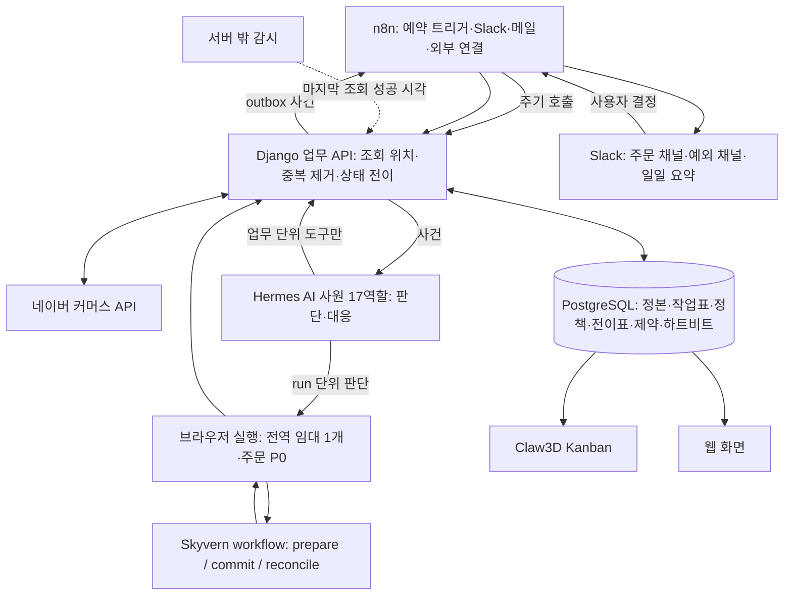

# Workspace Agent (스마트스토어, 블로그, 인프라관리 자동화)

Claw3D와 Hermes에서 사용하는 AI 직원의 역할 문서와 안전한 작업공간 정의를 관리하는 저장소다.
이 저장소는 Smartstore 조직 17명의 문서형 작업공간과 Hermes 프로필의 비민감 메타데이터를 보관한다.

## 범위
- https://smartstore.naver.com/allupstore
- https://noong2.tistory.com/
- Smartstore 계획에 정의된 직원 17명의 작업공간 문서
- 기존 `workspace-blog`, `workspace-infra` 작업공간 문서
- Smartstore Hermes 프로필의 표시용 `profile.yaml`
- 직원별 역할, 운영 원칙, 허용 범위, 승인 조건
- Claw3D와 Hermes 사이의 구성 관계를 설명하는 문서

직원 스킬은 아직 작성하지 않았다. 각 Smartstore 작업공간의 `skills/`는 런타임에서 비어 있는 상태이며,
이 저장소에도 `SKILL.md`를 포함하지 않는다.

## Smartstore 직원 17명

| 팀 | 프로필 | 작업공간 | 역할 |
|---|---|---|---|
| 지휘본부 | `ss-coo` | `workspace-ss-coo` | COO, 원본 증거와 장부 교차 검증 |
| 지휘본부 | `ss-cto` | `workspace-ss-cto` | CTO, 직원 상태와 문서 품질 점검 |
| 지휘본부 | `ss-cfo` | `workspace-ss-cfo` | CFO, 가격·쿠폰·이벤트·마케팅 조언 |
| 지휘본부 | `ss-cso` | `workspace-ss-cso` | CSO, 자금·지원사업·중장기 전략 조언 |
| 플랫폼팀 | `ss-platform` | `workspace-ss-platform` | 디자인·상품등록·상품관리 |
| 영업팀 | `ss-sales-sourcing` | `workspace-ss-sales-sourcing` | 매입정보 관측과 1차 검증 |
| 영업팀 | `ss-sales-market` | `workspace-ss-sales-market` | 경쟁가와 예상 이익 2차 검증 |
| 인프라팀 | `ss-infra-ops` | `workspace-ss-infra-ops` | 승인된 배포·연동·서비스 상태 |
| 인프라팀 | `ss-infra-data` | `workspace-ss-infra-data` | 백업·복원 결과와 보존 상태 |
| 구매팀 | `ss-order-watch` | `workspace-ss-order-watch` | 주문 사건 관제와 구매 큐 배정 |
| 구매팀 | `ss-purchase-monitor` | `workspace-ss-purchase-monitor` | 매입처·결제 계정 상태 점검 |
| 구매팀 | `ss-purchase-main` | `workspace-ss-purchase-main` | 구매 실행 주담당 |
| 구매팀 | `ss-purchase-backup` | `workspace-ss-purchase-backup` | 구매 실행 백업과 인계 |
| 구매팀 | `ss-delivery` | `workspace-ss-delivery` | 배송·직접전달 처리 |
| 회계팀 | `ss-accounting-web` | `workspace-ss-accounting-web` | 원장·원가·카드·조정 전표 |
| 회계팀 | `ss-accounting-naver` | `workspace-ss-accounting-naver` | 정산·세금계산서·입금 대조 |
| 경리팀 | `ss-bookkeeping` | `workspace-ss-bookkeeping` | 원본 분류와 승인 CSV 준비 |

기존 `workspace-blog`와 `workspace-infra`는 Smartstore 17명과 별도로 운영되는 기존 작업공간이다.

## 구성도

```text
                           사용자
                             |
                             v
                    +-------------------+
                    | Claw3D 3D Office  |
                    +---------+---------+
                              |
                              | WebSocket
                              v
                    +-------------------+
                    | Hermes Adapter    |
                    | 직원 레지스트리   |
                    +---------+---------+
                              |
             +----------------+----------------+
             |                                 |
             v                                 v
   +---------------------+          +---------------------+
   | Hermes 프로필       |          | 직원 작업공간       |
   | profiles/ss-*       |          | workspace-ss-*      |
   | 표시 메타데이터     |          | 역할 문서와 규칙    |
   +---------------------+          +---------------------+
             |                                 |
             +----------------+----------------+
                              |
                              v
                    +-------------------+
                    | 향후 스킬 연결    |
                    | 현재는 미설치     |
                    +-------------------+
```

### 런타임 관계

1. Claw3D는 Hermes Adapter의 직원 레지스트리에서 직원 목록을 조회한다.
2. Hermes 프로필 `ss-*`는 직원별 런타임 식별자와 표시 정보를 관리한다.
3. `workspace-ss-*`는 직원의 `IDENTITY.md`, `SOUL.md`, `AGENTS.md`, `TOOLS.md`, `USER.md`를 제공한다.
4. 업무 스킬은 향후 사용자 승인 후 별도로 추가한다.
5. 실제 상품·주문·결제·고객 메시지 변경은 역할 문서만으로 자동 허용되지 않는다.

## 15.5 설계 구성도

`project.md` 15.5의 판단·화면 조작·연결·정본 경계 구성을 반영한다.



## 직원별 Slack 앱

Smartstore 17명은 하나의 공용 Slack 앱이 아니라 직원별 Slack 앱을 사용한다.
각 앱은 동일한 Hermes Socket Mode 기본 구조를 사용하지만, 앱 이름·봇 토큰·앱 토큰·허용 사용자·담당 채널은 직원별로 분리한다.
Slack 앱과 봇의 표시명은 Claw3D에 이미 생성된 직원 이름을 유지하고 `이름 (ss-한글역할)` 형식으로 표시한다.
프로필 ID와 폴더명은 변경하지 않으며, 각 매니페스트의 설명에는 해당 직원의 원본 작업공간 경로를 기록한다.

```text
Slack App Olivia (ss-최고운영)
        |
        v
Hermes profile ss-coo
        |
        v
workspace-ss-coo
```

나머지 직원도 같은 구조로 연결한다. 앱 매니페스트는 `slack_apps/ss-*/app-manifest.yaml`에,
17개 앱의 채널·프로필·환경변수 매핑은 `slack_apps/employee-integrations.yaml`에 저장한다.
파일에는 실제 토큰이나 Slack 사용자 ID를 넣지 않는다.

Slack에서 앱을 만들 때는 각 직원 디렉터리의 매니페스트를 해당 앱의 App Manifest에 개별적으로 가져온다.
그 다음 Socket Mode를 켜고 발급된 토큰을 해당 Hermes 프로필의 `.env`에 등록한다.

## 폴더 트리

```text
workspace-agent/
├── README.md
├── .gitignore
├── slack_apps/
│   ├── employee-integrations.yaml
│   ├── ss-accounting-naver/app-manifest.yaml
│   ├── ss-accounting-web/app-manifest.yaml
│   ├── ss-bookkeeping/app-manifest.yaml
│   ├── ss-cfo/app-manifest.yaml
│   ├── ss-coo/app-manifest.yaml
│   ├── ss-cso/app-manifest.yaml
│   ├── ss-cto/app-manifest.yaml
│   ├── ss-delivery/app-manifest.yaml
│   ├── ss-infra-data/app-manifest.yaml
│   ├── ss-infra-ops/app-manifest.yaml
│   ├── ss-order-watch/app-manifest.yaml
│   ├── ss-platform/app-manifest.yaml
│   ├── ss-purchase-backup/app-manifest.yaml
│   ├── ss-purchase-main/app-manifest.yaml
│   ├── ss-purchase-monitor/app-manifest.yaml
│   ├── ss-sales-market/app-manifest.yaml
│   └── ss-sales-sourcing/app-manifest.yaml
├── profiles/
│   ├── ss-accounting-naver/profile.yaml
│   ├── ss-accounting-web/profile.yaml
│   ├── ss-bookkeeping/profile.yaml
│   ├── ss-cfo/profile.yaml
│   ├── ss-coo/profile.yaml
│   ├── ss-cso/profile.yaml
│   ├── ss-cto/profile.yaml
│   ├── ss-delivery/profile.yaml
│   ├── ss-infra-data/profile.yaml
│   ├── ss-infra-ops/profile.yaml
│   ├── ss-order-watch/profile.yaml
│   ├── ss-platform/profile.yaml
│   ├── ss-purchase-backup/profile.yaml
│   ├── ss-purchase-main/profile.yaml
│   ├── ss-purchase-monitor/profile.yaml
│   ├── ss-sales-market/profile.yaml
│   └── ss-sales-sourcing/profile.yaml
├── workspace-blog/
│   ├── AGENTS.md
│   ├── IDENTITY.md
│   ├── SOUL.md
│   ├── TOOLS.md
│   └── USER.md
├── workspace-infra/
│   ├── AGENTS.md
│   ├── IDENTITY.md
│   ├── SOUL.md
│   ├── TOOLS.md
│   └── USER.md
├── workspace-ss-accounting-naver/
├── workspace-ss-accounting-web/
├── workspace-ss-bookkeeping/
├── workspace-ss-cfo/
├── workspace-ss-coo/
├── workspace-ss-cso/
├── workspace-ss-cto/
├── workspace-ss-delivery/
├── workspace-ss-infra-data/
├── workspace-ss-infra-ops/
├── workspace-ss-order-watch/
├── workspace-ss-platform/
├── workspace-ss-purchase-backup/
├── workspace-ss-purchase-main/
├── workspace-ss-purchase-monitor/
├── workspace-ss-sales-market/
└── workspace-ss-sales-sourcing/
```

각 `workspace-ss-*` 폴더의 기본 구성은 다음과 같다.

```text
workspace-ss-<employee>/
├── AGENTS.md
├── IDENTITY.md
├── SOUL.md
├── TOOLS.md
├── USER.md
└── skills/
    └── (현재 비어 있음)
```

## 민감정보 제외 정책

다음 항목은 저장소에 포함하지 않는다.

- `.env`, API key, access token, OAuth token, 비밀번호
- Hermes `config.yaml`과 provider 설정
- 브라우저 쿠키, 세션, 인증 파일
- SQLite 및 기타 업무 데이터베이스
- 로그, 캐시, 런타임 상태, lock 파일
- 고객 이메일, 게임 키, 결제정보, 원본 장부
- 개인 계정 정보와 외부 서비스 인증정보
- 구매팀 직원의 스킬 본문과 구매 실행 자료
- Loaded, Yuplay, GMG 등 매입처별 스킬·플레이북·계정·가격·주문 자료

프로필 폴더는 런타임 설정 전체가 아니라 표시용 `profile.yaml`만 관리한다.
실제 비밀값과 운영 설정은 각 서버의 로컬 Hermes 설정에서만 관리한다.
구매팀 `workspace-ss-purchase-*`의 `skills/`는 로컬 폴더만 유지하고, GitHub에는 빈 폴더 표식
`.gitkeep`만 둘 수 있다. 스킬 본문과 매입처별 자료는 커밋·푸시하지 않는다.

## 동기화 원칙

서버에서 저장소로 동기화할 때는 문서 allowlist를 사용한다.

```bash
REPO=/home/ubuntu/workspace-agent
HERMES_HOME=/home/ubuntu/.hermes

for workspace in "$HERMES_HOME"/workspace-*; do
  [ -d "$workspace" ] || continue
  name=$(basename "$workspace")
  mkdir -p "$REPO/$name"
  for file in AGENTS.md IDENTITY.md SOUL.md TOOLS.md USER.md; do
    [ -f "$workspace/$file" ] && cp "$workspace/$file" "$REPO/$name/$file"
  done
done
```

구매팀 `workspace-ss-purchase-*`의 `skills/`와 Loaded·Yuplay·GMG 등 매입처 자료는
동기화 대상에서 제외한다. 해당 자료는 영업비밀로 간주하고 서버 로컬에만 보관한다.

동기화 후에는 다음을 확인한다.

```bash
git diff --check
find . -type f \( -name '.env' -o -name '*.sqlite3' -o -name '*.lock' \) -print
find . -type f -name 'SKILL.md' -print
git grep -niE 'loaded|yuplay|gmg|vendor' -- ':!README.md' || true
```

마지막 명령은 매입처명과 매입처 자료가 저장소에 들어갔는지 확인하기 위한 것이다.
