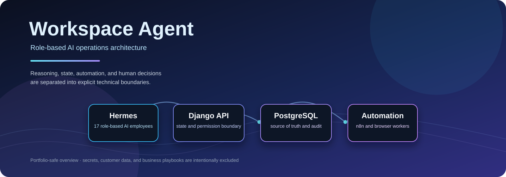
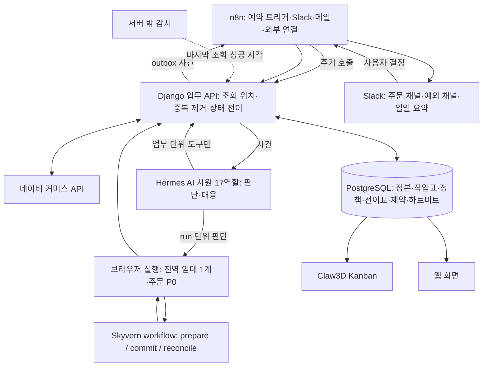
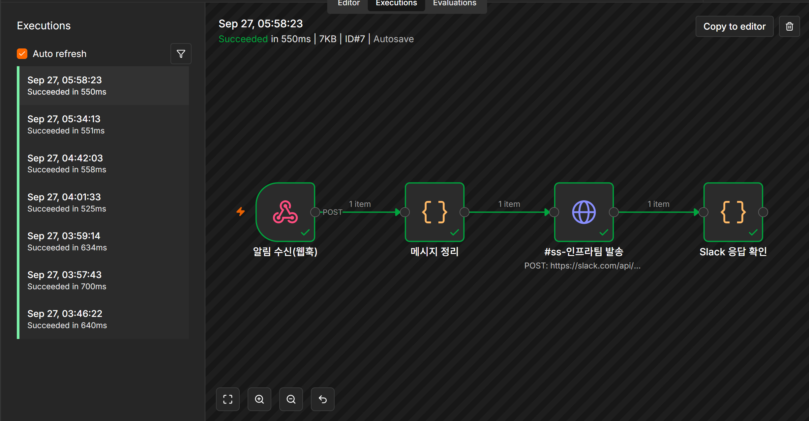
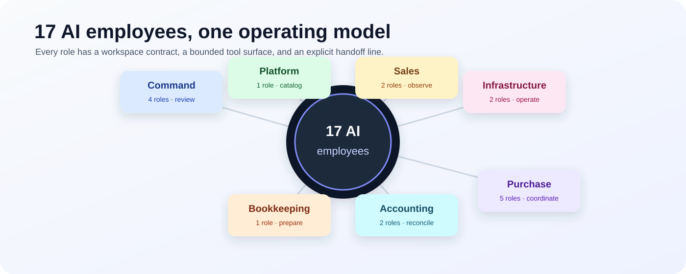

# Workspace Agent

<p align="center">
  
</p>

<p align="center">
  <strong>Role-based AI operations architecture</strong><br>
  <sub>Reasoning, workflow automation, browser execution, and human decisions separated by explicit boundaries.</sub>
</p>

<p align="center">
  
  
  
  
  <a href="LICENSE"></a>
</p>

<p align="center">
  <a href="#기술-스택">기술 스택</a> ·
  <a href="#전체-구성도">구성도</a> ·
  <a href="#17명-ai-직원-조직">AI 직원 조직</a> ·
  <a href="#공개-범위와-보안-정책">공개 범위</a>
</p>

<p align="center">
  <a href="https://smartstore.naver.com/allupstore">
    
  </a>
  <a href="https://noong2.tistory.com/">
    
  </a>
</p>

Smartstore 운영을 위한 AI 직원 조직과 Hermes·Claw3D 연동 구성을 공개 기술 문서로 정리한 저장소다.
이 저장소의 핵심은 특정 쇼핑몰의 영업자료가 아니라, **역할 기반 AI 직원**, **상태 중심 업무 코어**,
**브라우저 자동화 경계**, **이벤트 연결**, **운영 문서화**를 하나의 구조로 설계한 기술적 접근이다.

<div align="center">
  <table>
    <tr>
      <td align="center"><strong>17</strong><br><sub>역할 기반 AI 직원</sub></td>
      <td align="center"><strong>5</strong><br><sub>표준 직원 문서</sub></td>
      <td align="center"><strong>1</strong><br><sub>DB 정본</sub></td>
      <td align="center"><strong>3</strong><br><sub>브라우저 실행 단계</sub></td>
      <td align="center"><strong>5</strong><br><sub>Gemini 계정 수</sub></td>
      <td align="center"><strong>0</strong><br><sub>공개 운영 비밀</sub></td>
    </tr>
  </table>
</div>

## 프로젝트 요약

이 시스템은 17명의 역할별 AI 직원이 상품·주문·구매·배송·회계·인프라 업무를 분리해서 판단하도록 구성한다.
AI 대화나 Kanban 카드가 거래의 기준 기록이 되지 않도록 PostgreSQL을 정본으로 두고, n8n은 연결·예약·알림,
Hermes는 역할별 판단, 브라우저 실행기는 화면 조작, Slack은 진행상황과 사용자 결정을 전달하는 계층으로 제한한다.

<div align="center">
  <table>
    <tr>
      <td align="center" width="50%">
        <strong><a href="https://smartstore.naver.com/allupstore">Smartstore</a></strong><br>
        <sub>상품·주문·배송이 연결 상거래 표면</sub>
      </td>
      <td align="center" width="50%">
        <strong><a href="https://noong2.tistory.com/">Tistory Blog</a></strong><br>
        <sub>프로젝트 운영 기록·콘텐츠 채널</sub>
      </td>
    </tr>
  </table>
</div>

<div align="center">
  <table>
    <tr>
      <td width="50%" valign="top">
        <strong>공개 아키텍처</strong><br>
        <sub>직원 역할·권한·인계·상태 연동 구성도</sub>
      </td>
      <td width="50%" valign="top">
        <strong>비공개 실행 경계</strong><br>
        <sub>토큰·세션·거래 데이터·구매 스킬 런타임</sub>
      </td>
    </tr>
  </table>
</div>

이 저장소는 다음을 공개한다.

- AI 직원 17명의 역할·권한·인계·중단 조건 문서
- Hermes 프로필의 비민감 표시 메타데이터
- Claw3D 직원 레지스트리와 작업공간의 논리적 구조
- 직원별 Slack App Manifest와 Socket Mode 연동 계약
- 시스템 구성도, 데이터 흐름, 보안·민감정보 제외 원칙

비즈니스 거래 데이터, 인증정보, 계정 식별자, 고객정보, 매입처별 자료, 구매팀 스킬 본문은 공개하지 않는다.

## 기술 스택

<div align="center">
  <table>
    <tr>
      <td align="center"><strong>기술<br/>스택</strong></td>
      <td align="center"><br/><sub>Django</sub></td>
      <td align="center"><br/><sub>DRF</sub></td>
      <td align="center"><br/><sub>React</sub></td>
      <td align="center"><br/><sub>TypeScript</sub></td>
      <td align="center"><br/><sub>Vite</sub></td>
    </tr>
    <tr>
      <td align="center"><strong>데이터·<br/>워크플로</strong></td>
      <td align="center"><br/><sub>PostgreSQL</sub></td>
      <td align="center"><br/><sub>n8n</sub></td>
      <td align="center"><br/><sub>YAML</sub></td>
      <td align="center"><br/><sub>Markdown</sub></td>
      <td align="center"><br/><sub>Mermaid</sub></td>
    </tr>
    <tr>
      <td align="center"><strong>AI·실행·<br/>연동</strong></td>
      <td align="center"><br/><sub>Hermes Agent</sub></td>
      <td align="center"><br/><sub>Claw3D</sub></td>
      <td align="center"><br/><sub>Docker</sub></td>
      <td align="center"><br/><sub>Slack</sub></td>
      <td align="center"><br/><sub>WebSocket</sub></td>
    </tr>
    <tr>
      <td align="center"><strong>브라우저·<br/>운영</strong></td>
      <td align="center"><br/><sub>Chromium</sub></td>
      <td align="center"><br/><sub>Skyvern</sub></td>
      <td align="center"><br/><sub>Ubuntu</sub></td>
      <td align="center"><br/><sub>Python</sub></td>
      <td align="center"><br/><sub>Git</sub></td>
    </tr>
    <tr>
      <td align="center"><strong>업무<br/>연동</strong></td>
      <td align="center"><br/><sub>HTTP API</sub></td>
      <td align="center"><br/><sub>Webhook</sub></td>
      <td align="center"><br/><sub>공급처 커넥터</sub></td>
      <td align="center"><br/><sub>SMTP</sub></td>
      <td align="center"><br/><sub>승인 게이트</sub></td>
    </tr>
  </table>
</div>

<p align="center">
  <sub>업무 데이터는 DB 정본으로 관리하고, AI 판단·워크플로·브라우저 실행·사람의 승인을 명시적으로 분리한다.</sub>
</p>

### 기술 선택

<div align="center">
  <table>
    <tr>
      <td><strong>Reasoning</strong><br><sub>Hermes Agent · 역할별 판단과 인계</sub></td>
      <td><strong>Orchestration</strong><br><sub>n8n · 예약·polling·외부 연결</sub></td>
      <td><strong>State</strong><br><sub>PostgreSQL · 상태·감사·정합성</sub></td>
    </tr>
    <tr>
      <td><strong>Execution</strong><br><sub>Chromium · Skyvern · 브라우저 경계</sub></td>
      <td><strong>Decision Gate</strong><br><sub>Slack Socket Mode · 승인·예외</sub></td>
      <td><strong>Operations</strong><br><sub>Claw3D · Kanban · WebSocket</sub></td>
    </tr>
  </table>
</div>

| 계층 | 기술 | 담당 영역 | 설계 포인트 |
|---|---|---|---|
| 업무 백엔드 | **Django 5.2 LTS** | 업무 API, 권한 경계, 상태 전이, 작업표 | 모듈형 단일 백엔드로 시작해 운영 복잡도를 낮춘다 |
| API | **Django REST framework** | 외부 연동·웹 UI·AI 도구용 업무 단위 API | 범용 SQL 대신 역할별 업무 도구만 노출한다 |
| 웹 프론트엔드 | **React + TypeScript + Vite** | 모니터링, 상품, 회계, 작업 상태 화면 | 타입 안전한 화면 계약과 빠른 개발 루프를 사용한다 |
| 정본 데이터베이스 | **PostgreSQL** | 주문·구매·배송·정산·감사 이력·작업 임대 | 유니크 제약, `CHECK`, 상태 전이, 중복 방지를 DB에서 강제한다 |
| 워크플로 오케스트레이션 | **n8n** | API polling, 예약, 연결, Slack·메일 알림 | 거래 상태의 정본이 아니라 트리거·연결 계층으로 제한한다 |
| AI 직원 런타임 | **Hermes Agent** | 역할 문서, 세션, 도구 호출, 인계, 승인 흐름 | 17개 프로필을 독립 실행 단위로 분리한다 |
| 직원 운영 화면 | **Claw3D + Kanban** | 직원 레지스트리, 세션, 작업 카드, 인계 상태 | WebSocket 기반 레지스트리와 작업공간을 연결한다 |
| 주 브라우저 자동화 | **agy/Antigravity browser worker** | 동적 웹 화면 해석과 브라우저 행동 | 화면 조작을 업무 판단과 분리한 전용 실행 계층이다 |
| 보조 브라우저 자동화 | **Self-hosted Skyvern** | 주 브라우저 장애 시 예비 실행, 격리 로그인 검토 | `prepare / commit / reconcile` 단계로 실행 결과를 구분한다 |
| 브라우저 기반 | **Chromium** | 직원별 로그인 세션과 로컬 headless 실행 | 브라우저별 세션·권한·작업 범위를 분리한다 |
| 메시징·결정 게이트 | **Slack Socket Mode** | 정상 진행, 예외, 중단, 사용자 결정 | 키·이메일 원문·결제정보를 메시지에 넣지 않는다 |
| 메일 계층 | **SMTP/자체 메일 연동** | 업무 결과 전달과 반송 수집 | 발송 결과를 외부 식별자와 함께 기록한다 |
| 운영 환경 | **Ubuntu, Docker, systemd, WebSocket** | 서비스 기동, 프로세스 관리, 실시간 연결 | 서비스별 책임과 재기동 경계를 분리한다 |
| 문서·구성 | **Markdown, YAML, Mermaid** | 역할 계약, 앱 매니페스트, 구성도 | 실행 가능한 설정과 설명 문서를 같은 구조로 관리한다 |

## 핵심 설계 원칙

<div align="center">
  
  
  
  
</div>

<div align="center">
  <sub>상태를 먼저 기록하고, 도구를 좁게 노출하며, 실행과 판단을 분리하고, 실패를 재조정한다.</sub>
</div>

### 1. AI 판단과 거래 정본의 분리

AI 직원은 판단·해석·인계·예외 설명을 담당한다. 주문 상태, 금액, 외부 식별자, 작업 임대,
정산 결과는 PostgreSQL에 저장한다. 대화 이력이나 Kanban 카드만으로 완료·결제·발송을 확정하지 않는다.

### 2. 업무 단위 도구만 AI에 노출

AI 직원에게 범용 SQL이나 무제한 셸 권한을 주지 않고, 다음과 같은 업무 단위 경계를 사용한다.

- 주문 조회와 상태 확인
- 상품·가격 관측 기록
- 작업 큐 생성과 인계
- 구매 실행 준비·확정·결과 대조
- 배송·회계·감사 기록 연결
- Slack 보고와 사용자 결정 요청

### 3. 브라우저 실행과 run 판단의 분리

브라우저 worker는 화면을 읽고 정해진 행동을 수행한다. Hermes 직원은 실행 결과를 해석해 계속 진행할지,
중단할지, 예외로 전환할지 판단한다. 두 계층을 분리해 화면 자동화 변경이 업무 정책 전체를 바꾸지 않도록 한다.

### 4. 중복 실행과 부분 실패를 기본값으로 처리

외부 결제나 웹 화면 조작은 DB 트랜잭션과 동시에 확정할 수 없다. 따라서 다음을 기본 설계로 둔다.

- 외부 주문·결제·메일 식별자를 저장하고 재개 시 대조
- 작업 임대와 세대 번호로 동시 실행 차단
- `prepare / commit / reconcile` 단계 분리
- 확정 상태와 결과 불명 상태 분리
- DB 유니크 제약과 허용 상태 전이로 두 번째 확정 실행 차단
- outbox 사건으로 외부 알림을 재전달
- 마지막 성공 시각을 기록하고 서버 밖 감시로 중단을 탐지

## 전체 구성도

```text
                           사용자
                             |
                             v
                    +-------------------+
                    | Claw3D 3D Office  |
                    +---------+---------+
                              |
                              | WebSocket
                              v
                    +-------------------+
                    | Hermes Adapter    |
                    | 직원 레지스트리   |
                    +---------+---------+
                              |
             +----------------+----------------+
             |                                 |
             v                                 v
   +---------------------+          +---------------------+
   | Hermes 프로필       |          | 직원 작업공간       |
   | profiles/ss-*       |          | workspace-ss-*      |
   | 표시 메타데이터     |          | 역할 문서와 규칙    |
   +---------------------+          +---------------------+
             |                                 |
             +----------------+----------------+
                              |
                              v
                    +-------------------+
                    | 업무 스킬 연결    |
                    | 민감 스킬은 비공개 |
                    +-------------------+
```

### 런타임 관계

1. Claw3D는 Hermes Adapter의 직원 레지스트리에서 직원 ID·표시명·역할을 조회한다.
2. Hermes 프로필은 직원별 런타임 식별자와 모델·세션 설정을 관리한다.
3. `workspace-ss-*`는 `IDENTITY.md`, `SOUL.md`, `AGENTS.md`, `TOOLS.md`, `USER.md`를 제공한다.
4. 직원 문서는 역할·허용 범위·중단 조건·인계선을 선언한다.
5. 실제 민감 스킬은 서버 로컬에서만 연결하며 이 저장소에는 본문을 포함하지 않는다.

## 업무 데이터 흐름

<div align="center">
  <table>
    <tr>
      <td align="center"><strong>01<br>Ingest</strong><br><sub>외부 API·n8n<br>조회·중복 제거</sub></td>
      <td align="center">→</td>
      <td align="center"><strong>02<br>Decide</strong><br><sub>Django·PostgreSQL<br>상태 전이·승인</sub></td>
      <td align="center">→</td>
      <td align="center"><strong>03<br>Execute</strong><br><sub>Hermes·Browser worker<br>prepare / commit</sub></td>
      <td align="center">→</td>
      <td align="center"><strong>04<br>Reconcile</strong><br><sub>outbox·감사 이력<br>결과 대조</sub></td>
    </tr>
  </table>
</div>



### 계층별 책임

| 계층 | 책임 | 하지 않는 일 |
|---|---|---|
| 외부 커머스 API | 주문·상품·정산 정보 제공 | 내부 상태의 유일한 정본 역할 |
| n8n | 예약, polling, 연결, 알림, 사건 생성 | 결제 판단과 거래 상태 보관 |
| Django API | 업무 규칙, 상태 전이, 권한, 작업 임대, outbox | 브라우저 화면을 직접 해석 |
| PostgreSQL | 상태·금액·식별자·감사 이력의 정본 | AI 판단을 대신 수행 |
| Hermes | 역할별 판단, 결과 해석, 인계, 예외 보고 | 범용 DB 직접 조작 |
| Browser worker | 화면 관측과 브라우저 행동 | 전체 업무 정책 결정 |
| Slack | 진행상황, 예외, 사용자 결정 | 비밀값·원문 고객정보 저장 |
| Claw3D/Kanban | 운영 시각화와 작업 관리 | 거래 정본 저장 |

### 사건 알림 경로

운영 런타임·프록시·heartbeat·배치는 공통 기록기(`ss_alert.py`)를 호출해 사건을
JSON Lines outbox에 append한다. 별도 전송기(`ss_alert_watch.py`)는 cursor와 quiet
상태를 관리하면서 새 사건만 묶어 자동화 웹훅으로 보내고, 후속 워크플로가 팀 알림으로
전달한다. 웹훅 자격증명, workflow·credential DB, 실제 로그와 상태 파일은 공개 범위에서
제외한다. 공개 구현은 [`infra/alerts`](infra/alerts/)에 정리했다.

<p align="center">
  
</p>

## 17명 AI 직원 조직

직원은 프로필 ID, 표시명, 작업공간, 역할 문서로 구성된다. 표시명은 운영 화면에서 식별하기 쉽도록
`이름 (ss-역할)` 형식을 사용하며, 프로필 ID와 폴더명은 안정적인 내부 식별자로 유지한다.

<div align="center">
  <table>
    <tr>
      <td align="center"><strong>지휘본부</strong><br><sub>검증·전략·품질</sub></td>
      <td align="center"><strong>플랫폼·영업</strong><br><sub>상품·시장·매입 관측</sub></td>
      <td align="center"><strong>인프라</strong><br><sub>서비스·데이터·복구</sub></td>
      <td align="center"><strong>구매·배송</strong><br><sub>주문·실행·전달</sub></td>
      <td align="center"><strong>회계·경리</strong><br><sub>원장·정산·분류</sub></td>
    </tr>
  </table>
</div>

<p align="center">
  
</p>

| 팀 | 직원 | 프로필 | 작업공간 | 기술적 책임 |
|---|---|---|---|---|
| 지휘본부 | Olivia | `ss-coo` | `workspace-ss-coo` | 원본 증거와 장부의 교차 검증 |
| 지휘본부 | Ethan | `ss-cto` | `workspace-ss-cto` | 직원 상태·문서·연결 품질 점검 |
| 지휘본부 | Sophia | `ss-cfo` | `workspace-ss-cfo` | 가격·이벤트·성과 지표 조언 |
| 지휘본부 | Daniel | `ss-cso` | `workspace-ss-cso` | 자금·정책·중장기 전략 조언 |
| 플랫폼팀 | Mia | `ss-platform` | `workspace-ss-platform` | 상품·재고·상세·플랫폼 작업 |
| 영업팀 | Noah | `ss-sales-sourcing` | `workspace-ss-sales-sourcing` | 매입정보 관측과 1차 검증 |
| 영업팀 | Ava | `ss-sales-market` | `workspace-ss-sales-market` | 경쟁가·예상 이익 2차 검증 |
| 인프라팀 | Mason | `ss-infra-ops` | `workspace-ss-infra-ops` | 승인된 배포·연동·서비스 상태 |
| 인프라팀 | Liam | `ss-infra-data` | `workspace-ss-infra-data` | 백업·복원·보존 상태 |
| 구매팀 | Emma | `ss-order-watch` | `workspace-ss-order-watch` | 주문 사건 관제와 작업 큐 |
| 구매팀 | Lucas | `ss-purchase-monitor` | `workspace-ss-purchase-monitor` | 계정 상태와 경고 모니터링 |
| 구매팀 | James | `ss-purchase-main` | `workspace-ss-purchase-main` | 구매 실행 주담당 |
| 구매팀 | Grace | `ss-purchase-backup` | `workspace-ss-purchase-backup` | 인계·복구와 활성 백업 |
| 구매팀 | Leo | `ss-delivery` | `workspace-ss-delivery` | 배송·직접전달 처리 |
| 회계팀 | Nora | `ss-accounting-web` | `workspace-ss-accounting-web` | 원장·원가·카드·조정 전표 |
| 회계팀 | Henry | `ss-accounting-naver` | `workspace-ss-accounting-naver` | 정산·세금계산서·입금 대조 |
| 경리팀 | Ella | `ss-bookkeeping` | `workspace-ss-bookkeeping` | 원본 분류와 승인 CSV 준비 |

### 직원 문서 계약

- `IDENTITY.md`: 표시명과 역할 식별
- `SOUL.md`: 판단 원칙과 금지 범위
- `AGENTS.md`: 실행 주기, 인계선, 승인, 중단 조건
- `TOOLS.md`: 허용 도구와 데이터 범위
- `USER.md`: 사용자 응답 형식과 보고 기준

지휘본부는 직접 실무를 실행하지 않고 검증·조언·인계를 담당한다. 구매·결제·고객정보·민감한
업무 데이터는 역할 문서만으로 권한이 생기지 않으며, 연결된 업무 도구와 별도 승인 경계를 거쳐야 한다.

## Slack 연동 모델

17명은 하나의 공용 앱이 아니라 직원별 Slack App Manifest를 사용한다. 각 매니페스트는 다음 계약을 가진다.

- Slack Socket Mode 기반 연결
- 직원별 앱 표시명·봇 표시명·프로필 ID
- 역할별 담당 채널과 DM 흐름
- Hermes gateway 명령 endpoint
- 토큰·사용자 ID는 저장소에 기록하지 않음

<div align="center">
  <table>
    <tr>
      <td align="center"><strong>17 Apps</strong><br><sub>직원별 표시명·봇·권한</sub></td>
      <td align="center">→</td>
      <td align="center"><strong>Socket Mode</strong><br><sub>실시간 이벤트 전달</sub></td>
      <td align="center">→</td>
      <td align="center"><strong>Hermes Gateway</strong><br><sub>프로필·작업공간 연결</sub></td>
      <td align="center">→</td>
      <td align="center"><strong>Approval Gate</strong><br><sub>예외·확정·중단</sub></td>
    </tr>
  </table>
</div>

```text
Slack App Olivia (ss-최고운영)
        |
        v
Hermes profile ss-coo
        |
        v
workspace-ss-coo
```

매니페스트는 `slack_apps/ss-*/app-manifest.yaml`에, 17개 앱의 비밀값 없는 매핑은
`slack_apps/employee-integrations.yaml`에 저장한다. 실제 토큰 발급과 환경변수 등록은 운영 서버의
비공개 설정에서 수행한다.

## 저장소 파일 트리

<details>
<summary><strong>공개 저장소 구조 펼쳐보기</strong></summary>

```text
workspace-agent/
├── README.md
├── LICENSE
├── .gitignore
├── docs/
│   └── assets/
│       ├── employee-network.svg
│       ├── n8n-alert-flow.png
│       └── workspace-agent-hero.svg
├── infra/
│   └── alerts/
│       ├── bin/              # 사건 기록기와 자동화 웹훅 전송기
│       ├── producers/        # 런타임·프록시·heartbeat·배치 알림 지점
│       ├── systemd/          # 1분 주기 전송 서비스·타이머
│       └── README.md         # 공개 알림 계약과 운영 비공개 경계
├── slack_apps/
│   ├── employee-integrations.yaml
│   ├── ss-accounting-naver/app-manifest.yaml
│   ├── ss-accounting-web/app-manifest.yaml
│   ├── ss-bookkeeping/app-manifest.yaml
│   ├── ss-cfo/app-manifest.yaml
│   ├── ss-coo/app-manifest.yaml
│   ├── ss-cso/app-manifest.yaml
│   ├── ss-cto/app-manifest.yaml
│   ├── ss-delivery/app-manifest.yaml
│   ├── ss-infra-data/app-manifest.yaml
│   ├── ss-infra-ops/app-manifest.yaml
│   ├── ss-order-watch/app-manifest.yaml
│   ├── ss-platform/app-manifest.yaml
│   ├── ss-purchase-backup/app-manifest.yaml
│   ├── ss-purchase-main/app-manifest.yaml
│   ├── ss-purchase-monitor/app-manifest.yaml
│   ├── ss-sales-market/app-manifest.yaml
│   └── ss-sales-sourcing/app-manifest.yaml
├── profiles/
│   ├── ss-accounting-naver/profile.yaml
│   ├── ss-accounting-web/profile.yaml
│   ├── ss-bookkeeping/profile.yaml
│   ├── ss-cfo/profile.yaml
│   ├── ss-coo/profile.yaml
│   ├── ss-cso/profile.yaml
│   ├── ss-cto/profile.yaml
│   ├── ss-delivery/profile.yaml
│   ├── ss-infra-data/profile.yaml
│   ├── ss-infra-ops/profile.yaml
│   ├── ss-order-watch/profile.yaml
│   ├── ss-platform/profile.yaml
│   ├── ss-purchase-backup/profile.yaml
│   ├── ss-purchase-main/profile.yaml
│   ├── ss-purchase-monitor/profile.yaml
│   ├── ss-sales-market/profile.yaml
│   └── ss-sales-sourcing/profile.yaml
├── workspace-blog/
│   ├── AGENTS.md
│   ├── IDENTITY.md
│   ├── SOUL.md
│   ├── TOOLS.md
│   └── USER.md
├── workspace-infra/
│   ├── AGENTS.md
│   ├── IDENTITY.md
│   ├── SOUL.md
│   ├── TOOLS.md
│   └── USER.md
├── workspace-ss-accounting-naver/
│   ├── AGENTS.md
│   ├── IDENTITY.md
│   ├── SOUL.md
│   ├── TOOLS.md
│   └── USER.md
├── workspace-ss-accounting-web/
├── workspace-ss-bookkeeping/
├── workspace-ss-cfo/
├── workspace-ss-coo/
├── workspace-ss-cso/
├── workspace-ss-cto/
├── workspace-ss-delivery/
├── workspace-ss-infra-data/
├── workspace-ss-infra-ops/
├── workspace-ss-order-watch/
├── workspace-ss-platform/
├── workspace-ss-purchase-backup/
│   └── skills/.gitkeep
├── workspace-ss-purchase-main/
│   └── skills/.gitkeep
├── workspace-ss-purchase-monitor/
│   └── skills/.gitkeep
├── workspace-ss-sales-market/
└── workspace-ss-sales-sourcing/
```

</details>

각 Smartstore workspace의 표준 문서는 동일한 계약을 따르며, 구매팀 `skills/`는 영업비밀 보호를 위해
빈 폴더 표식만 저장한다. Git은 빈 폴더를 추적할 수 없으므로 `.gitkeep`을 사용한다.

## 기술적 포인트

<div align="center">
  <table>
    <tr>
      <td align="center"><strong>Stateful</strong><br><sub>재시작·중복·부분 실패 복구</sub></td>
      <td align="center"><strong>Role-based</strong><br><sub>17개 역할과 명시적 권한 경계</sub></td>
      <td align="center"><strong>Replaceable</strong><br><sub>브라우저 실행기 교체 가능</sub></td>
      <td align="center"><strong>Auditable</strong><br><sub>상태 전이·outbox·감사 이력</sub></td>
    </tr>
  </table>
</div>

### 상태 중심 설계

스케줄러나 AI 대화가 중단되어도 마지막 성공 조회 지점, 외부 식별자, 작업 임대, 상태 전이를
DB에서 복구할 수 있다. 이는 단순 자동화 스크립트와 달리 재시작·중복·부분 실패를 설계 대상으로 삼은 부분이다.

### 권한 중심 AI 조직

17명의 AI 직원을 하나의 범용 에이전트로 만들지 않고 역할별 프로필·작업공간·문서·도구 범위로 분리했다.
문서 계약은 사람 조직의 직무기술서와 비슷한 역할을 하며, 실행 권한은 DB와 업무 API가 추가로 제한한다.

### 브라우저 자동화의 교체 가능성

주 브라우저 worker와 보조 엔진을 업무 코어에서 분리해 화면 변경이나 자동화 엔진 교체가
상태 모델·감사 이력·직원 역할을 다시 설계하는 일로 번지지 않도록 했다.

### 문서와 실행 설정의 분리

공개 저장소에는 재현 가능한 구조와 비민감 계약만 두고, 운영 서버에는 비공개 환경변수,
브라우저 세션, 인증 설정, 업무 스킬 본문을 둔다. 공개 가능한 설계와 운영 비밀을 분리하는
저장소 경계를 명확히 한 것이 이 프로젝트의 중요한 운영 설계다.

## 공개 범위와 보안 정책

<div align="center">
  <table>
    <tr>
      <td align="center"><strong>공개</strong><br><sub>역할 문서 · 구조 · 계약 · 구성도<br>재현 가능한 공개 레이어</sub></td>
      <td align="center"><strong>비공개</strong><br><sub>인증정보 · 거래 데이터 · 세션<br>운영 런타임 · 구매 실행 자료</sub></td>
    </tr>
  </table>
</div>

저장소에 포함하지 않는 항목:

<table>
  <tr>
    <td>API key, access token, OAuth token, 비밀번호, private key</td>
    <td>Slack Bot/App Token과 사용자 ID</td>
  </tr>
  <tr>
    <td>브라우저 쿠키·세션·인증 파일</td>
    <td>PostgreSQL·SQLite·n8n 실행 데이터</td>
  </tr>
  <tr>
    <td>고객 이메일, 결제정보, 게임 키, 원본 장부</td>
    <td>매입처별 계정·가격·주문 자료와 구매 실행 playbook</td>
  </tr>
  <tr>
    <td>구매팀의 <code>SKILL.md</code> 및 실제 스킬 구현</td>
    <td>로그, 캐시, 런타임 상태, 내부 비밀 설정</td>
  </tr>
</table>

`.gitignore`는 구매팀 스킬과 매입처별 자료가 실수로 추가되지 않도록 경로명 기반 차단 규칙도 포함한다.
공개 저장소에 올리는 파일은 문서 allowlist와 staged diff 검사를 거친다.

## 검증 명령

<div align="center">
  
  
  
</div>

<details>
<summary><strong>공개 저장소 검증 명령 펼쳐보기</strong></summary>

```bash
git diff --check
git ls-files '*SKILL.md'
git ls-files '*skills/*'
git ls-files | grep -Ei 'credentials|secrets|token|private' || true
find . -type f \( -name '.env' -o -name '*.sqlite3' -o -name '*.lock' \) -print
```

</details>

정상 공개 상태에서는 실제 `SKILL.md`, 인증파일, 데이터베이스, 매입처별 파일이 출력되지 않아야 한다.

## 현재 상태

- Smartstore AI 직원 17명 프로필·작업공간 문서화 완료
- Claw3D 직원 레지스트리와 Hermes 작업공간 연결 구조 반영
- 직원별 Slack App Manifest와 Socket Mode 연동 계약 정리
- Django·React·PostgreSQL·n8n·Hermes·Claw3D·브라우저 worker를 포함한 목표 아키텍처 문서화
- 구매팀 스킬과 매입처별 영업비밀은 저장소에서 제외
- 저장소는 공개 구조와 비민감 운영 문서에 한정

## 라이선스

이 저장소의 원본 문서, 구성 파일, SVG 시각화 자산은 [Apache License 2.0](LICENSE)으로 공개한다.
외부 서비스·상표·라이브러리·의존성은 각 권리자의 라이선스와 이용약관을 따르며, 이 저장소의 라이선스가
그 권리를 대신 부여하지 않는다. 비공개 운영 데이터와 서버 로컬 스킬은 이 저장소의 배포 대상이 아니다.
